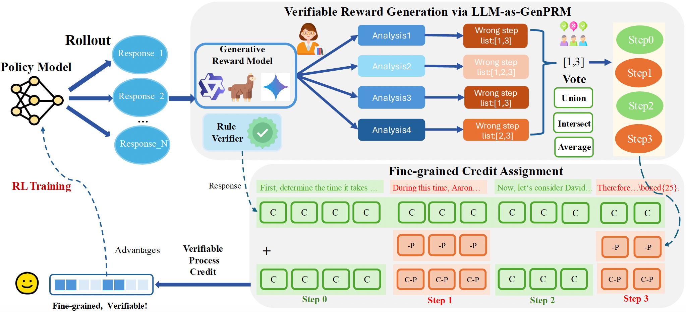

# CAPO

Official repository for the paper: **"CAPO: Towards Enhancing LLM Reasoning through Verifiable Generative Credit Assignment"**

*[Paper on ArXiv (link will be added soon)]*

---

## 🚧 Repository Status: Code is Coming Soon! 🚧

Thank you for your interest in our work!

The code and experimental details are currently being organized and cleaned up for public release. We are working to ensure the code is well-documented and easy to use.

We will upload the full implementation as soon as possible!

---

## Overview

This repository contains the official implementation for **CAPO (Credit Assignment Policy Optimization)**, a novel method to enhance the reasoning abilities of Large Language Models (LLMs).


### The Challenge in RLVR: Coarse-Grained Credit Assignment


Reinforcement Learning with Verifiable Rewards (RLVR) assigns rewards based solely on the final outcome, failing to provide **differentiated feedback**. This lack of granular feedback hinders the model’s ability to learn robust reasoning processes.

While other solutions exist, they are often inaccurate (like PPO's value estimates) or require expensive, time-consuming process supervision labels (like Process Reward Models).

### Our Solution: CAPO

CAPO introduces a simple yet powerful approach to achieve **fine-grained, verifiable credit assignment**:

1.  **Generate Step-wise Critiques:** We leverage an off-the-shelf, general-purpose LLM as a **Generative Process Reward Model (LLM-as-GenPRM)**. This LLM-as-GenPRM analyzes the entire trajectory and generates critiques for each reasoning step in a single, efficient pass.
2.  **Assign Token-Level Rewards:** These critiques are translated into verifiable, token-level rewards, refining the original, uniform reward signal.
3.  **Enhance Robustness:** To improve accuracy, we employ a voting mechanism over multiple generated critiques.

This allows the model to directly learn which parts of its reasoning to keep and which to fix.

### Experiment Results

Across six challenging mathematical benchmarks and three out-of-domain benchmarks, CAPO consistently outperforms SFT and other RL-based fine-tuning methods using various model backbones (Llama, Qwen). Further analysis confirms that CAPO effectively encourages the model to learn and generate correct reasoning pathways. More results could be found in our paper.

## Acknowledgements

Our implementation is built upon the excellent **G-Core** framework built by Wechat Search, Tencent Inc. We are grateful to the authors for their well-structured and efficient codebase, which provided a strong foundation for our research.
-   **G-Core Paper: "G-Core: A Simple, Scalable and Balanced RLHF Trainer"** [https://arxiv.org/abs/2507.22789](https://arxiv.org/abs/2507.22789)
-   **G-Core Repository:** [https://github.com/Tencent/G-Core-GH](https://github.com/Tencent/G-Core-GH)

## Citation

If you find our work or this repository useful for your research, please consider citing our paper.

Since our work is based on G-Core, we also highly recommend citing their original paper if you build upon our code:

```bibtex
@misc{wu2025gcoresimplescalablebalanced,
      title={G-Core: A Simple, Scalable and Balanced RLHF Trainer}, 
      author={Junyu Wu and Weiming Chang and Xiaotao Liu and Guanyou He and Haoqiang Hong and Boqi Liu and Hongtao Tian and Tao Yang and Yunsheng Shi and Feng Lin and Ting Yao},
      year={2025},
      eprint={2507.22789},
      archivePrefix={arXiv},
      primaryClass={cs.LG},
      url={https://arxiv.org/abs/2507.22789}, 
}
```

## Contact

For any questions about the paper or the upcoming code, please feel free to open an issue in this repository or contact [guofuxie@ruc.edu.cn].
